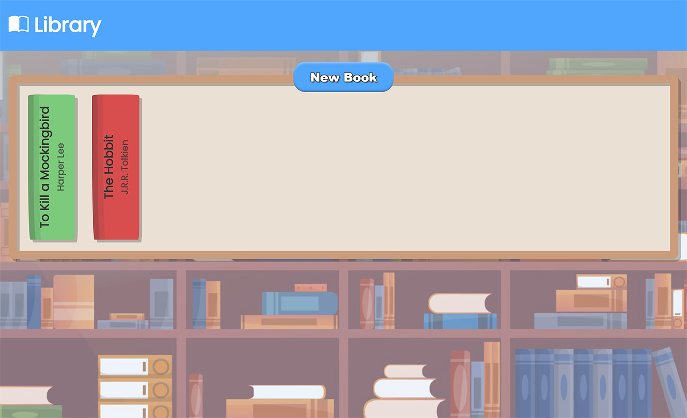

# Library

## Summary

This is a mock Library where you can add books via the button to add the title, author, how many pages it has and if it has been read or not via a form. After the form is submitted the information is passed through an Object Constructor and pushed through a function to add the visual div as well as pass the book object into an array. The array index is tied to a generated data-attribute. Users can view the detail via the shelf, or click on each book individually for more detail.

## Key Features

- **Add Books**: Users can add books to library and define their name, author, page count and read status.
- **Hover Interface**: Users can delete individual books or toggle read status on hover.
- **Pop-up Interface**: Users can also select books on the shelf for clear details and delete or alter read status.
- **Book Colours**: The background color of the book switches from green/red based on read status.

## Credits
- **Image**: Background image obtained from [Vecteezy](https://www.vecteezy.com/free-vector/library-background).
- **Icons**: Icons obtained from [Bootstrap](https://icons.getbootstrap.com).

## Screenshot

